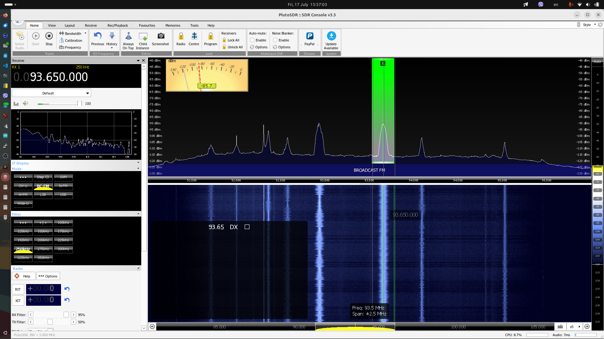
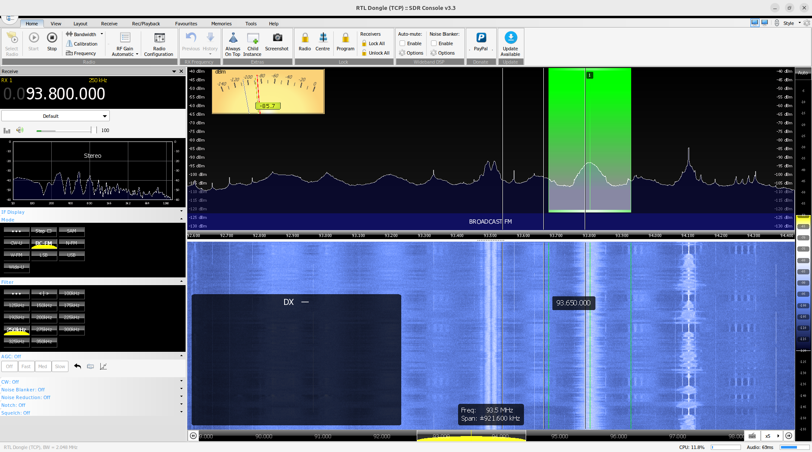

# SDR Console on Wine

Unofficial scripts for installing the Windows SDR Console application on Linux
in an isolated Wine prefix. This project is not affiliated with or supported by
SDR-Radio.com, WineHQ, or radio hardware vendors.

The project scripts and documentation are [MIT licensed](LICENSE). SDR Console
is proprietary software and remains subject to its vendor's terms; its installer
is not included or redistributed here.

## Screenshot





## Supported Scope

- Ubuntu 24.04 LTS is the tested platform target. Current Debian/Ubuntu
  derivatives on 64-bit (`amd64`) systems are accepted but should be validated
  before being called supported.
- A local graphical desktop session is required to run SDR Console. Wayland and
  X11 are both intended to work without changing the user's desktop settings.
- Wine comes only from the standard `apt` repositories. Setup enables `i386`
  packages and installs both 32-bit and 64-bit Wine support because the SDR
  Console setup program is 32-bit while the application is 64-bit.
- The first intended radio path is an already configured PlutoSDR over IP. The
  scripts do not alter networks, probe radios, or change PlutoSDR firmware.
- Wine cannot give SDR Console's Windows RTL USB driver direct access to a
  physical Linux USB device. Use the optional native `rtl_tcp` bridge for a
  locally attached RTL-SDR; SDR Console then connects to `127.0.0.1:1234`.
- Other USB receivers are **not tested**. The project makes no generic USB
  compatibility claim.

## Quick Start

1. Download the desired latest stable **64-bit** SDR Console Windows installer
   from its official source.
2. Put exactly one `.exe` file in
   [`place-setup-exe-file-here/`](place-setup-exe-file-here/). The installer is
   ignored by Git.
3. From this directory, review the planned actions:

   ```bash
   ./setup.sh --dry-run
   ```

4. Install it as your normal desktop user. Do **not** prepend `sudo`:

   ```bash
   ./setup.sh
   ```

   The script asks you to confirm that you obtained the installer from the
   official source and accept its terms, then requests your `sudo` password
   only when Wine packages must be installed.
5. Start SDR Console from the desktop application menu or run:

   ```bash
   sdr-console
   ```

Setup creates the Wine prefix and SDR Console settings in
`~/.local/share/sdr-console-wine/`. It does not start SDR Console automatically.
If `~/.local/bin` is not on your `PATH`, open a new terminal session or use the
application-menu launcher.

### RTL-SDR over USB

For a locally connected RTL-SDR, install and start the native bridge:

```bash
./setup.sh --rtl-tcp
```

This uses an existing `rtl_tcp` command or installs Ubuntu's `rtl-sdr` package,
then creates a per-user systemd service that keeps the dongle on Linux and
listens only on `127.0.0.1:1234`. In SDR Console, open **Select Radio**, add or
select **RTL Dongle (TCP)**, and use address `127.0.0.1` and port `1234`. Do
not use **RTL Dongle USB**: that source expects a Windows USB driver and will
report zero devices under Wine.

### Missing Display Symbols

If SDR Console shows rectangles between **High** and **Zoom**, the missing
symbols are the `>|<` panoramic-centering control. Wine's built-in Webdings and
Wingdings fonts have incomplete glyph coverage. Install the full Webdings font
if it is not already present, then apply the prefix-only repair and restart SDR
Console:

```bash
sudo apt install ttf-mscorefonts-installer
./setup.sh --fix-fonts
```

`--fix-fonts` keeps all changes within SDR Console's isolated Wine prefix. It
copies the locally installed Webdings font and downloads the pinned,
SHA-256-verified [Deepin OpenSymbol Wingdings-compatible font](https://github.com/linuxdeepin/deepin-opensymbol-fonts)
from its upstream project. It does not download or redistribute Microsoft fonts.
The replacement remains subject to its upstream font license.
Normal setup also applies the repair automatically.

### Selected Controls And Application Style

The yellow marker shown for the selected mode, such as **BC-FM**, is drawn by
SDR Console's own MFC user-interface style, not by Wine. Change it from the
**Style** menu at the right side of the SDR Console ribbon; Windows 7 and the
Office 2007 styles are available. This choice is stored by SDR Console and does
not change the Linux desktop or other Wine applications.

### Interface Scaling

SDR Console uses the isolated Wine prefix, so `wine winecfg` changes the wrong
settings unless `WINEPREFIX` is set. Use the project command instead, then
restart SDR Console:

```bash
./setup.sh --dpi 144
```

Use `96` for classic Windows scaling, `120` for a moderate increase, and `144`
for a 1080p laptop panel around 143 PPI. The command updates only the SDR
Console prefix and never changes the desktop's GNOME/KDE scaling.

## Commands

| Command | Purpose |
| --- | --- |
| `./setup.sh` | Install, or repair a matching existing installation. |
| `./setup.sh --dry-run` | Inspect installer selection, packages, and generated files without changing anything. |
| `./setup.sh --diagnose` | Check Wine packages, prefix, executable, and launchers without probing hardware. |
| `./setup.sh --interactive` | Show the Windows installer instead of using silent mode. |
| `./setup.sh --upgrade` | Intentionally install a different staged installer. Normal reruns never upgrade automatically. |
| `./setup.sh --rtl-tcp` | Install and start the local RTL-SDR TCP bridge; no SDR Console installer is required. |
| `./setup.sh --rtl-tcp --dry-run` | Show the RTL-SDR bridge actions without changing the system. |
| `./setup.sh --fix-fonts` | Install full Webdings when locally available plus a free Wingdings-compatible font in the Wine prefix, then restart SDR Console. |
| `./setup.sh --dpi 144` | Set the SDR Console Wine prefix to 144 DPI, then restart SDR Console. |
| `./setup.sh --reset` | Remove the isolated installation and all SDR Console settings after confirmation. |
| `./uninstall.sh` | Remove project-owned prefix, launchers, logs, and state after confirmation. |
| `./uninstall.sh --dry-run` | List the files that uninstall would remove. |

`--yes` bypasses the vendor-terms confirmation in setup and the destructive
confirmation in reset/uninstall. It is intended only for deliberate automation.

## What Setup Changes

The setup script displays progress for system checks, dependencies, Wine-prefix
creation, SDR Console installation, launcher creation, and verification.

- It uses `apt` only when packages are missing. The core required packages are
  `wine`, `wine64`, and `wine32:i386`; enabling `i386` is a system-wide package
  setting. `./setup.sh --rtl-tcp` additionally installs `rtl-sdr` only when
  `rtl_tcp` is not already available.
- It uses the manually supplied installer and does not download SDR Console,
  Wine components, or Windows runtime installers from third-party sources.
- Full setup output is written locally to
  `${XDG_STATE_HOME:-~/.local/state}/sdr-console-wine/logs/`.
- It creates `~/.local/bin/sdr-console` and a desktop-menu launcher. Both use
  the isolated prefix.
- It installs prefix-local full Webdings and Wingdings-compatible fonts so Wine
  selects them and the `>|<` display-centering symbols render correctly. The
  free Wingdings-compatible font download is pinned and SHA-256 verified.
- The optional RTL-SDR bridge is a per-user service named
  `sdr-console-rtl-tcp.service`. Its settings are in
  `~/.config/sdr-console-wine/rtl-tcp.conf`; it is deliberately bound to
  localhost and is never exposed on the LAN.
- It does not collect, send, or upload diagnostics or usage data. Apart from
  `apt` package downloads, the scripts make no network requests.

The provided installer file name and SHA-256 are recorded in local state. A
release becomes a tested baseline only after the validation below; any other
single staged installer is installable but is not implicitly certified by this
project.

## Compatibility Matrix

| Receiver path | First-release status | Notes |
| --- | --- | --- |
| PlutoSDR over IP | Target for validation | Network configuration is the user's responsibility; setup does not probe it. |
| RTL-SDR via native `rtl_tcp` | Supported local bridge | Linux owns the USB dongle; SDR Console uses `RTL Dongle (TCP)` at `127.0.0.1:1234`. |
| RTL-SDR direct USB in Wine | Unsupported | SDR Console's Windows USB driver cannot enumerate Linux USB devices through Wine. |
| Other USB receivers | Not tested | Add only after testing the exact model and Linux/Wine access path. |

## Updates, Recovery, and Removal

Normal reruns preserve a healthy installation and SDR Console settings. If the
SHA-256 of the staged installer differs from the recorded one, setup stops and
requires `--upgrade`; this avoids surprise updates.

For a broken installation, run `./setup.sh --diagnose` first. It checks only
local state and does not connect to an SDR. Use `./setup.sh --interactive` when
the silent Windows installer needs investigation.

For RTL-SDR bridge failures, inspect its user-service log:

```bash
journalctl --user -u sdr-console-rtl-tcp.service -e
```

Confirm Linux can open the dongle before starting SDR Console:

```bash
rtl_test -t
```

`./setup.sh --reset` and `./uninstall.sh` also stop and remove the project-owned
RTL-SDR bridge service and configuration.

`./setup.sh --reset` and `./uninstall.sh` remove the Wine prefix, application
settings, local state/logs, and launchers. They deliberately leave Wine's `apt`
packages installed because they may be shared by other applications. Users who
installed Wine only for this project can review and run `sudo apt autoremove`
themselves.

## Release Validation

Before claiming a tested release, validate it on a clean Ubuntu 24.04 user
account or disposable VM: one-command setup, application startup, and signal
reception through an already reachable PlutoSDR over IP. Validate RTL-SDR via
the local `rtl_tcp` bridge separately; direct USB use inside Wine is unsupported.
